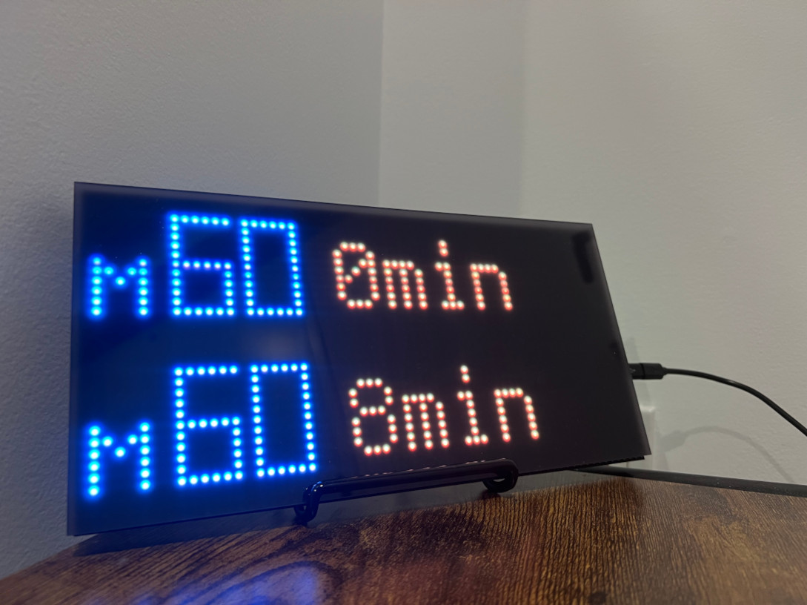
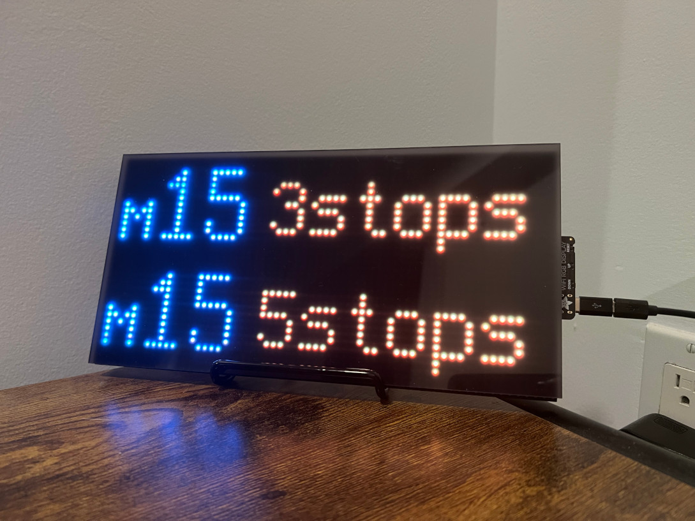
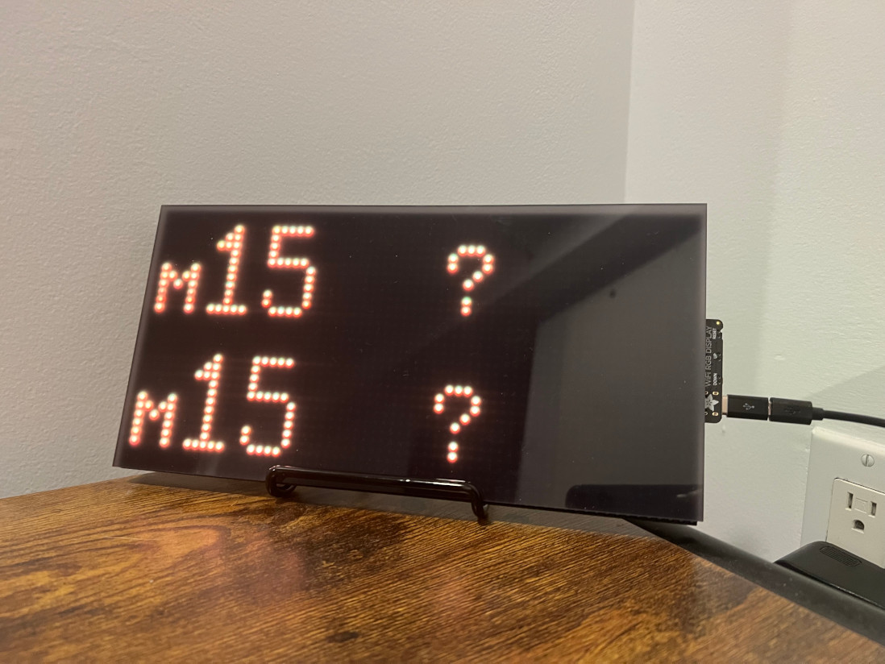
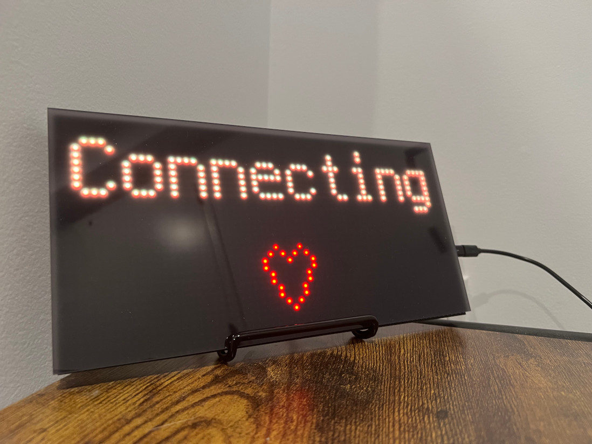

# LED MTA Bus Time Display

This project utilizes a [64 x 32 LED Matrix](https://www.adafruit.com/product/2278) and an [Adafruit Matrix Portal](https://www.adafruit.com/product/4745) to display real-time information on bus stops in New York City using the [MTA Bus Time API](https://bustime.mta.info/wiki/Developers/Index). We utilize [CircuitPython](https://circuitpython.org/) Version 9.x and it is recommended to use the [Mu Editor](https://codewith.mu/) for rapid deployment when code is modified. A [starter kit](https://www.adafruit.com/product/4812) is also available which includes a power supply and an acrylic diffusion panel.

## Contents
1. [Background](#background)
2. [Examples](#examples)
3. [Materials](#materials)
    * [Important Precautions](#️-important-precautions-️)
4. [Setup](#setup)
5. [Known Issues](#known-issues)
6. [Modifications](#modifications)
7. [License](#license)

## Background

This was developed as a gift with the goal of being both functional in everyday use and an aesthetic piece of home decor. There are various frames, covers, and 3D printed meshes than can be added to alter the look of the display, along with [acrylic diffusion panels](https://www.adafruit.com/product/4594) like the one shown in the images below.

## Examples

The display will loop through various bus stops listed in the `config.py`, alternating between showing the minutes until arrival and the number of stops away.

Displaying the number of minutes remaining until bus arrival at the specified stop:

Blue LEDs denote that this bus is a Select bus. Non-Select buses appear in the orange-yellow color instead of the blue color.

Displaing the number of stops remaining until arrival:

In case of errors fetching the data or if there are less than 2 buses en route, a "?" is displayed instead of the minutes or stops.

When the Matrix Portal boots, a loading screen is displayed while the device connects to the internet and fetches the current local time:

## Materials

1. [64 x 32 LED Matrix](https://www.adafruit.com/product/2278)
2. [Adafruit Matrix Portal](https://www.adafruit.com/product/4745)
3. Adequate Power Supply and adapters (See [Important Precautions](#️-important-precautions-️))
4. [Acrylic Diffusion Panels](https://www.adafruit.com/product/4594) and [Adhesives](https://www.adafruit.com/product/4813) (Optional)
5. [Stand](https://www.adafruit.com/product/1679) (Optional)

### ⚠️ IMPORTANT PRECAUTIONS ⚠️

At the time of writing, the [Starter Kit](https://www.adafruit.com/product/4812) includes a [5V 2.4A Power Supply](https://www.adafruit.com/product/1995) and [adapter](https://www.adafruit.com/product/4299). Depending on how many pixels will be illuminated at the same time, a higher amperage power supply like [4 amp](https://www.adafruit.com/product/1466) or [10 amp](https://www.adafruit.com/product/658) with [an adapter](https://www.adafruit.com/product/368) might be necessary. Please plan power usage ahead of time and take all safety precautions. 

**Prior to commencing this project, it is essential to review and adhere to all manufacturer instructions and warnings.**

## Setup

1. [Request an API key](https://bustime.mta.info/wiki/Developers/Index) from the NYC MTA. 
2. Connect and [prepare the Matrix Portal](https://learn.adafruit.com/matrix-portal-new-guide-scroller/prep-the-matrixportal).
3. Place the Matrix Portal into reset mode and [Install CircuitPython](https://learn.adafruit.com/matrix-portal-new-guide-scroller/install-circuitpython)
5. Install the necessary CircuitPython modules
6. Create an Adafruit IO account to access the `network.get_local_time` function.
7. Create a `settings.toml` to store WiFi credentials, MTA API key, and Adafruit IO secrets.
8. Clone the repository and run the `code.py` file if it does not automatically execute.
9. (Optional) If your local time is not NY time, additional code changes may be needed to correct the different timezones.
10. (Optional) Edit the `config.py` to update the stops that should be displayed, add other bus icon characters, or edit the loading  and/or add other bus icon characters.

## Known Issues

### Why is the Expected Arrival Time negative?
Sometimes the API response does not include an `ExpectedArrivalTime` value and it only has an `AimedArrivalTime`. In this scenario, we use the `AimedArrivalTime` which may be before the current local time.

### Why are two buses the same number of stops away, but not the same number of minutes away?
I believe some buses may still be held in the bus terminal or not yet actively commuting towards the stop. In these cases, the number of minutes away can diverge drastically from the number of stops away. 

### Why does the panel fail to boot sometimes?
Occasionally, connecting to the internet upon initial boot of the portal fails, even after waiting a few seconds and trying again. This may be due to signal strength or various intermittent issues. Checking the `network.is_connected` status seems to help, as done in `code.py`. Nevertheless, a simple reboot usually does the trick if the Matrix Portal fails to boot.

### Why is "distance" not used in the mta.py file?
The `distance` variable is retrieved and formatted in the `mta.py` file but nothing is done with it in `code.py`. This distance is sometimes represented in miles and sometimes in number of stops, so it can be redundant when including the `stops_away` variable. The code was left in as an example and in case this metric ever needs to be added in the future.

## Modifications

### Do I need to write out each pixel to display or can I use a font?
This project utilizes both methods of displaying pixels so you will find examples of both within the code that can be used for reference. Text is displayed easily using the `adafruit_display_text.label.Label` module and the default font. This method is used to display the Bus Time info. When drawing icons or bus route names, the method of writing specific pixels is used instead. This method allows us to replicate the bus numbers more accurately than a predetermined font and create complex designs and color combinations. This method involves creating a Bitmap and Palette, adding the Bitmap to a TileGrid, and then adding the TileGrid to the Group. Additional [documentation on displayio library](https://learn.adafruit.com/circuitpython-display-support-using-displayio/library-overview) can be useful for more advanced use cases.

### What about the subway?
At the time of this writing, the [MTA's feeds](https://api.mta.info/#/subwayRealTimeFeeds) for subway lines a uses a separate API with different methodology and data structures. The subway feeds and APIs are not currently part of this project. To integrate the subway times, create a function to retrieve data from the MTA and pass the same dictionary of variables as the `get_arrivals` in `mta.py`. 

## License

This project is licensed under the MIT License - see the [LICENSE](LICENSE) file for details.
